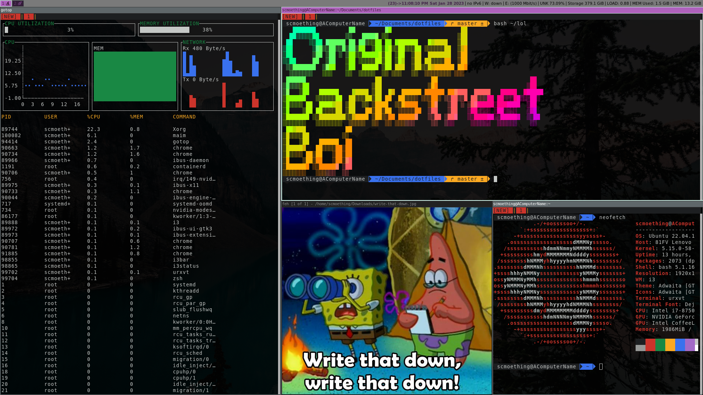

# dotfiles
I change my config files somewhat frequently so I want to keep them in a repository where I can see the changes. Although I don't see the use of it for others (since I'm a newbie at it) but hopefully some person will benefit by having this open to the public :).

# What my i3wm (i3 Window Manager) looks like(ish)

## i3 makeup
You can find all the pretty-fying I did for i3 in the I3ConfigColors
